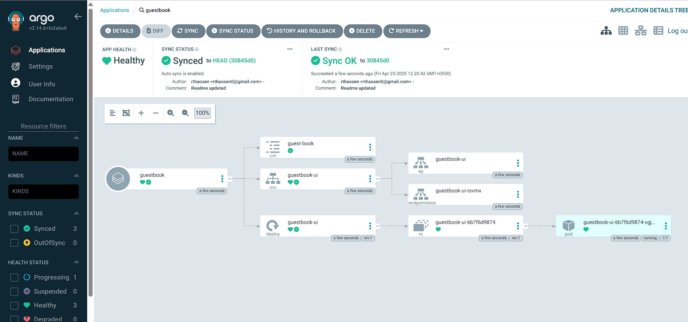

# EKS and Argo CD Setup

## Introduction
Setting up Amazon EKS clusters and configuring Argo CD for managing applications across multiple clusters.

## Prerequisites

Ensure the following tools are installed:

- **kubectl**: Command line tool for working with Kubernetes clusters.  
  [Installation Guide](https://docs.aws.amazon.com/eks/latest/userguide/install-kubectl.html)

- **eksctl**: Command line tool for managing EKS clusters.  
  [Installation Guide](https://docs.aws.amazon.com/eks/latest/userguide/eksctl.html)

- **AWS CLI**: Command line tool for interacting with AWS services.  
  [Installation Guide](https://docs.aws.amazon.com/cli/latest/userguide/cli-chap-install.html)

- **Argo CD CLI**: Command line tool for managing Argo CD.  
  [Installation Guide](https://argo-cd.readthedocs.io/en/stable/cli_installation/#installation)

After installing the AWS CLI, configure it with:

aws configure

# EKS Setup

## EKS Clusters Creation

eksctl create cluster --name hub-cluster --region us-west-1

eksctl create cluster --name spoke-cluster-1 --region us-west-1

eksctl create cluster --name spoke-cluster-2 --region us-west-1

## EKS Clusters Deletion

eksctl delete cluster --name hub-cluster --region us-west-1

eksctl delete cluster --name spoke-cluster-1 --region us-west-1

eksctl delete cluster --name spoke-cluster-2 --region us-west-1

# Argo CD Setup
## Install Argo CD in hub cluster
commands:
kubectl create namespace argocd

kubectl apply -n argocd -f https://raw.githubusercontent.com/argoproj/argo-cd/stable/manifests/install.yaml

## Run Argo CD in HTTP Mode(Insecure - not recommended for production environments)
https://github.com/argoproj/argo-cd/blob/54f1572d46d8d611018f4854cf2f24a24a3ac088/docs/operator-manual/argocd-cmd-params-cm.yaml#L82

## Expose Argo CD Server Service in NodePort Mode
command: kubectl edit svc argocd-server -n argocd

and change the type to NodePort from ClusterIP

## Add Spoke Clusters to Argo CD
Install the Argo CD CLI and run the below command to add spoke clusters:

argocd cluster add <spoke-clustername> --server <argocd_server_ip:port>

Now we can create applications in both the spoke clusters.

